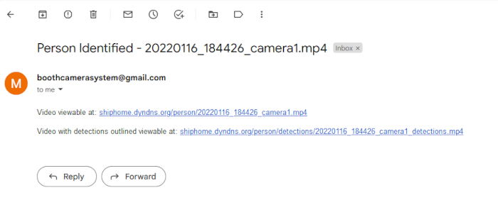

# Security System

This security system setup was a custom solution developed that can be:
1. Powered via solar power
2. Works on weak, unstable Wi-Fi or other wireless  medium
3. Can detect humans, vehicles and animals and perform real-time alerts on detection of humans and vehicles
4. Store 2 weeks of footage locally
5. Scalable

After setting up the camera nodes and web server, on detection, the user gets and email like this containing the original video and the superimposed detections:

The video would look like this:

# Setup

## Server side setup
This setup is fairly in-depth since the project specifiecations wanted a windows machine to be the server. This requires a lot of workarounds, though most are elegant.  
1. Install [miniconda](https://docs.conda.io/en/latest/miniconda.html#windows-installers) and create environment (`conda env create -f environment-detector.yml`)
2. Clone [CameraTraps](https://github.com/microsoft/CameraTraps) and [ai4eutils](https://github.com/microsoft/ai4eutils) and move them into the anaconda environment (`cp -r CameraTraps/* ai4eutils/* ~/miniconda3/envs/cameratraps-detector/Lib/site-packages/`)
3. Download model [here](https://lilablobssc.blob.core.windows.net/models/camera_traps/megadetector/md_v4.1.0/md_v4.1.0.pb), more info on the [Megadetector github page](https://github.com/microsoft/CameraTraps/blob/master/megadetector.md)
4. Install apache server. I used [Apache Lounge](https://www.apachelounge.com/download/)
	1. Copy `Apache24` folder to `C:/Aapche24`.
	2. Inside `C:/Aapche24/conf/httpd.conf`, change document directory to media directory. Ex. `C:\Users\boothm\Desktop\security_system/media`.
	3. Test installation by opening an admin powershell and running `./httpd.exe` from `C:\Apache24\bin`
	4. If all goes well, install as a service using `./httpd.exe -k install`.
	5. Enable start on boot (`Set-Service -Name Apache2.4 -StartupType 'Automatic'`
	6. Start service `Start-Service -Name Apache2.4` or reboot
5. Install [cygwin](https://www.cygwin.com/) with rsync, openssh and openssl packages and add bin to the path `C:\cygwin64\bin`
6. Setup openssh using [this](https://docs.oracle.com/cd/E24628_01/install.121/e22624/preinstall_req_cygwin_ssh.htm#EMBSC281) guide
7. Test rsync installation

## Rpi setup
1. Install raspian lite
2. Install rpi cam web interface
3. Enable camera
4. Enable ssh
5. Write to wpa_supplicant
6. Give static IP
7. Setup config file
8. clone repo
9. run daemons
10. set hostname

# security_system

This repo will serve to document my progress on building a cheap security system for my uncle.

As of Dec. 18th 2021, the workflow will go as follows:
1. Setup cheap motion detecting cameras throughout his kansas property using solar panels for power.
The property will have weak wifi, so we need to limit video throughput as much as possible

2. Video that has motion is transferred back to the central hub (hopefully just a GPU-enabled computer on his property) and the video is evaluated. It will be sorted into 3 categories: human, animal, vehicle, and others will be deleted

3. Notifications will be sent out appropriately depending on the videos added (mainly just humans or vehicles)

Notes:
Mark wants as much of the raw footage as possible, probably if an issue arises on his property. Most likely, we will only be able to store a week's worth of footage per camera. We should issue a command to stop recording if the footage needs to be manually collected.

# GPU support
Installation needs:
tensorflow-gpu=1.14.0
CUDA 10.0
cuDNN 7.4
nvidia driver (nvidia-smi)
To enable GPU:
Make sure tensorflow-gpu is set in the environment-detector.yml file and install the appropriate CUDA library listed here: https://www.tensorflow.org/install/source#linux

# Tasks:
1. Setup actual server with needed software
2. Setup cameras to sync folder with windows
3. Make cameras record constantly
4. Setup way to pause cameras overwriting data
5. Streamline camera setup

# Cameras code:
Command to move from remote system to local system, and delete file from remote system if necessary
`rsync --compress --remove-source-files --progress --partial --partial-dir=.rsync_partial/ /home/user/send/* user@172.31.203.75:/mnt/c/Users/user/Desktop/security_system/unevaluated/`
`ssh-keygen -t rsa` - generate RSA keys, then add the public key to the host machine under `~/.ssh/authorized_keys`

After setting up ssh transfers, setup a crontab job for monitor.sh, which will handle moving the images into unevaluated/ without having to worry about race conditions and monitoring. monitor.sh waits 1 minute after the program was written to, just to make sure it is done. This stops rsync from transferring a partially written to file and isn't timer-based, which stops rsync from restarting or waiting so long before starting.
