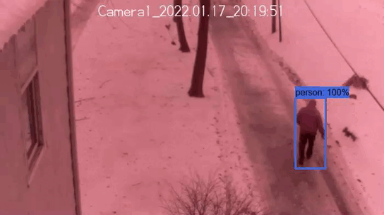
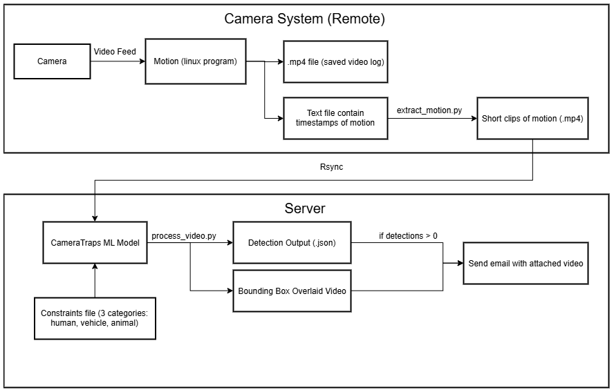

# Security System

This repo serves as the setup instructions needed to setup the server-side of a security system that is:
* Solar powered
* Reliable on weak, unstable Wi-Fi or other wireless medium
* Can detect humans, vehicles and animals and perform real-time alerts on detection of humans and vehicles
* Store 2 weeks of footage locally
* Scalable

The camera-side setup is not included here.

The output of the security system consists of an email and corresponding video:

A rough workflow is:
1. For the camera nodes, run Rpi-Cam-Web-Interface to record all video.
2. Use motion to write to a file the timestamps the motion was occurring.
3. A custom program extracts the motion clips from the total footage to need to transmit minimal video footage.
4. rsync transfers the files across an unstable network.
5. A modified version of Microsoft’s CameraTraps is used to detect an object of interest, put it in an appropriate folder on a web server and send an email for notification.

# Block Diagram

# Setup

## Server side setup
The hardware is any windows computer with any dedicated GPU.

This setup is fairly in-depth since the cliented wanted the server to run on a windows machine. This requires a lot of workarounds, though most are elegant.  
1. Install [miniconda](https://docs.conda.io/en/latest/miniconda.html#windows-installers) and create environment (`conda env create -f environment-detector.yml`)
2. Clone [CameraTraps](https://github.com/microsoft/CameraTraps) and [ai4eutils](https://github.com/microsoft/ai4eutils) and move them into the anaconda environment (`cp -r CameraTraps/* ai4eutils/* ~/miniconda3/envs/cameratraps-detector/Lib/site-packages/`)
3. Download model [here](https://lilablobssc.blob.core.windows.net/models/camera_traps/megadetector/md_v4.1.0/md_v4.1.0.pb), more info on the [Megadetector github page](https://github.com/microsoft/CameraTraps/blob/master/megadetector.md)
4. Install apache server. I used [Apache Lounge](https://www.apachelounge.com/download/)
	1. Copy `Apache24` folder to `C:/Aapche24`.
	2. Inside `C:/Aapche24/conf/httpd.conf`, change document directory to media directory. Ex. `C:\Users\boothm\Desktop\security_system/media`.
	3. Test installation by opening an admin powershell and running `./httpd.exe` from `C:\Apache24\bin`
	4. If all goes well, install as a service using `./httpd.exe -k install`.
	5. Enable start on boot `Set-Service -Name Apache2.4 -StartupType 'Automatic'`
	6. Start service `Start-Service -Name Apache2.4` or reboot
5. Install [cygwin](https://www.cygwin.com/) with rsync, openssh and openssl packages and add bin to the path `C:\cygwin64\bin`
6. Setup openssh using [this](https://docs.oracle.com/cd/E24628_01/install.121/e22624/preinstall_req_cygwin_ssh.htm#EMBSC281) guide
7. Test rsync installation

### GPU support
Installation needs:
tensorflow-gpu=1.14.0
CUDA 10.0
cuDNN 7.4
nvidia driver (nvidia-smi)
To enable GPU:
Make sure tensorflow-gpu is set in the environment-detector.yml file and install the appropriate CUDA library listed here: https://www.tensorflow.org/install/source#linux

## Node Setup
The nodes are a raspberry pi with an infrared camera in a water proof case. A 12V solar power connected to a battery provides power during the night, and a buck converter converts the power to the RPi's 5V needed.

1. Install raspian lite
2. Install rpi cam web interface
3. Enable camera
4. Enable ssh
5. Write to wpa_supplicant
6. Give static IP
7. Setup config file
8. clone repo
9. run daemons
10. set hostname

### Cameras code:
Command to move from remote system to local system, and delete file from remote system if necessary
`rsync --compress --remove-source-files --progress --partial --partial-dir=.rsync_partial/ /home/user/send/* user@<server_ip>>:/mnt/c/Users/user/Desktop/security_system/unevaluated/`
`ssh-keygen -t rsa` - generate RSA keys, then add the public key to the host machine under `~/.ssh/authorized_keys`

After setting up ssh transfers, setup a crontab job for `monitor.sh`, which will handle moving the images into unevaluated/ without having to worry about race conditions and monitoring. `monitor.sh` waits 1 minute after the program was written to, just to make sure it is done. This stops rsync from transferring a partially written to file and isn't timer-based, which stops rsync from restarting or waiting so long before starting.
